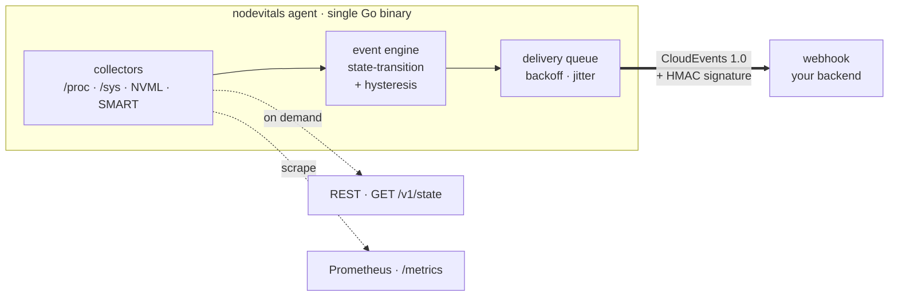
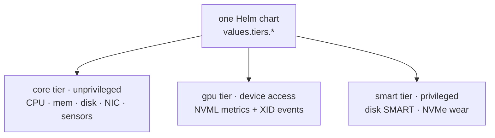

<p align="center">
  <a href="https://keiailab.com">
    
  </a>
</p>

# nodevitals

**Unified hardware telemetry for Kubernetes nodes — one agent instead of three exporters.**

[](LICENSE)
[](go.mod)
[](https://kubernetes.io/)
[](https://github.com/KeiaiLab/nodevitals/releases)

## Design assets

| Asset | Path | Usage |
|---|---|---|
| Centered service symbol | [`docs/branding/symbol.png`](docs/branding/symbol.png) | GitHub README, Artifact Hub icon/screenshot |
| Keiailab base symbol | [`docs/branding/base-symbol.png`](docs/branding/base-symbol.png) | Source reference for the outer rotating-arrow mark |
| Branding guide | [`docs/BRANDING.md`](docs/BRANDING.md) | Public visual usage rules |

nodevitals is a single Go agent that reads deep hardware state from each Kubernetes node —
CPU, memory, disk/SMART, NIC, sensors, and NVIDIA GPUs — turns threshold crossings into
**state-transition events**, and delivers them three ways: a **webhook push** to your own
backend, a **REST snapshot**, and a **Prometheus `/metrics`** endpoint. One binary and one
Helm chart replace the `node_exporter` + `dcgm-exporter` + `smartctl_exporter` wiring.

> [!NOTE]
> **Status: early development (v0.2-dev).** The pipeline (collect → event engine →
> webhook/REST/metrics → Helm) works end-to-end, and all three tiers are implemented:
> **core** (load, CPU, memory, disk I/O, network, hwmon — unprivileged), **SMART**
> (SATA/NVMe disk health via a privileged, opt-in DaemonSet), and **GPU** (NVIDIA
> NVML metrics + async XID error events via an unprivileged, opt-in DaemonSet,
> shipped as a separate glibc/cgo `:v-gpu` image since the go-nvml binding needs
> cgo while core/smart stay static). The GPU tier's NVML path is unit- and
> compile-checked without hardware — a real-GPU smoke test is still pending. See
> the [design doc](docs/superpowers/specs/2026-07-17-nodevitals-design.md),
> [M2 design](docs/superpowers/specs/2026-07-18-nodevitals-m2-design.md), and
> [M2b GPU design](docs/superpowers/specs/2026-07-18-nodevitals-m2b-gpu-design.md).

## Why

Getting hardware telemetry off a Kubernetes node today usually means running three separate
things: `node_exporter` for core metrics (it ships **no** SMART collector and defers GPUs to
dcgm), `dcgm-exporter` for NVIDIA GPUs, and `smartctl_exporter` for disks. Three DaemonSets,
three configs, three release cadences — and all of them **scrape-only**, so there is no push
path to your own backend and no first-class notion of an event.

nodevitals collapses that into one agent, and adds an **event-first** model on top of the
usual `/metrics` scrape:

| Before                                                   | With nodevitals                         |
| -------------------------------------------------------- | --------------------------------------- |
| `node_exporter` + `dcgm-exporter` + `smartctl_exporter`  | one agent                               |
| 3 DaemonSets · 3 configs · scrape-only                   | 1 Helm chart · 1 config · push + scrape |

It does **not** try to be a dashboard — you keep your own Grafana/backend. It replaces the
*collection and delivery* layer, not the visualization one.

## Architecture

The pipeline is deliberately linear and each stage is independently testable — the whole thing
runs with zero real hardware (fixture filesystems and mocks), so the local pre-push gate is a
fast `go test`:



Kubernetes' Pod Security Admission is evaluated per-pod, and reading SMART needs elevated
privileges while `/proc`·`/sys` do not — so a single privileged pod would forfeit the
unprivileged benefit. nodevitals resolves this with a **tiered single-agent** design: one
codebase, one image, one chart, rendering **1–3 DaemonSets by privilege tier**:



## Quickstart

```bash
# The core/smart tiers read the host's /proc, /sys, /dev via hostPath, which
# BOTH the PSA Baseline and Restricted profiles forbid — label the namespace
# to the privileged level first (the gpu tier does not need this):
kubectl label namespace default pod-security.kubernetes.io/enforce=privileged --overwrite

# Install the core tier via Helm. The webhook signing secret is stored in a
# Kubernetes Secret and injected via env — never written to a ConfigMap. Prefer
# --set-file (reads the key from a file, keeping it out of shell history) or an
# external secret store over an inline --set for the secret value.
printf %s "$WEBHOOK_SIGNING_KEY" > /tmp/wh0.secret
helm install nodevitals ./deploy/chart \
  --set 'webhooks[0].url=https://your-backend.example/hooks/hardware' \
  --set-file 'webhooks[0].secret=/tmp/wh0.secret'

# Verify
kubectl get daemonset nodevitals-core
curl http://<pod-ip>:9847/metrics | grep nodevitals_hw_
```

> [!IMPORTANT]
> **Pod Security Admission:** core and smart mount hostPath (`/proc`, `/sys`,
> `/dev`), which is forbidden by both PSA Baseline and Restricted — those tiers
> require a namespace labeled `pod-security.kubernetes.io/enforce=privileged`
> (see the chart's `NOTES.txt`). The **gpu tier is Restricted-compliant**. This
> is inherent to node-level hardware telemetry, not a hardening gap — see the
> [production-readiness report](docs/production-readiness.md).

### Tier runtime prerequisites

The optional tiers each need one cluster-specific value. Both default to off so
core stays a drop-in, and both fail *quietly* when they are needed but unset —
so set them deliberately rather than waiting for a symptom:

| Tier | Value | When you need it | Symptom if missing |
|---|---|---|---|
| gpu | `tiers.gpu.runtimeClassName` | The NVIDIA runtime is exposed as a RuntimeClass rather than the node default — the usual gpu-operator/k3s setup. Check `kubectl get runtimeclass`; the name is typically `nvidia`. | Pod CrashLoops with `nvml init: ERROR_LIBRARY_NOT_FOUND` — `NVIDIA_VISIBLE_DEVICES` alone does not trigger the runtime hook that injects `libnvidia-ml.so`. |
| smart | `tiers.smart.privileged` | Always, to read real disks. The device cgroup denies a non-privileged container's `open()` on `/host/dev/*`, and `SYS_RAWIO`/`SYS_ADMIN` do not lift it. | **Silent**: the probe skips unreadable devices by design, so you get a healthy pod, `/healthz` ok, and zero `nodevitals_hw_smart_*` series. |

```bash
helm install nodevitals ./deploy/chart \
  --set tiers.gpu.enabled=true   --set tiers.gpu.runtimeClassName=nvidia \
  --set tiers.smart.enabled=true --set tiers.smart.privileged=true
```

Rules, thresholds, and webhook secrets are hashed into each DaemonSet's pod
template, so editing them rolls the pods — the agent reads its config once at
startup, and without that hash a `helm upgrade` would rewrite the ConfigMap and
change nothing.

Or run the binary directly against a config file:

```bash
go install github.com/KeiaiLab/nodevitals/cmd/nodevitals@latest
nodevitals -config ./config.yaml
```

## Configuration

One YAML file drives collection, event rules, and delivery sinks:

```yaml
tier: core
intervalSeconds: 15
procRoot: /host/proc            # node's /proc, mounted read-only

rules:                           # hardware state-transition rules
  - metric: load1
    device: cpu
    condition: load_high
    severity: warning
    threshold: 8.0
    enterFor: 3                  # 3 consecutive breaches → ENTER event
    exitFor: 3                   # 3 consecutive clears  → EXIT event

sinks:
  webhook:                       # push to your backend (CloudEvents + HMAC)
    - url: https://your-backend.example/hooks/hardware
      secret: whsec_...          # HMAC signing key
  metrics:                       # Prometheus scrape endpoint
    enabled: true
    listenAddr: ":9847"
```

(The Helm chart exposes the metrics port as `metrics.port` in `values.yaml` and renders the
matching `listenAddr` into the pod's ConfigMap for you.)

Events are delivered as [CloudEvents 1.0](https://cloudevents.io/) envelopes signed with
[Standard Webhooks](https://www.standardwebhooks.com/) HMAC-SHA256, so any conformant receiver
can verify them.

## Delivery surfaces

| Surface              | Endpoint / transport                | Use                                            |
| -------------------- | ----------------------------------- | ---------------------------------------------- |
| **Webhook push**     | CloudEvents 1.0 + HMAC → your URL   | primary — hardware events to your own backend  |
| **REST snapshot**    | `GET /v1/state`                     | on-demand current state (debugging)            |
| **Prometheus**       | `GET /metrics`                      | drop into an existing Prometheus/Grafana stack |

## Building

```bash
make all         # go vet + go test + build
make docker      # build the distroless/static image (~22 MB) — core & smart tiers
make build-gpu   # build the glibc :v-gpu image (GPU tier — go-nvml needs cgo)
make chart-lint  # helm template | kubeconform
```

Requirements: Go 1.26+, and (for the chart) Helm 3 + kubeconform. The core/smart static image
is built for `linux/amd64` and `linux/arm64`; the GPU `:v-gpu` image is `linux/amd64`-only
(the go-nvml binding needs cgo, and arm64 GPU support is deferred).

## Supply chain

Supply-chain gates are local `make` targets (not CI — see [ADR-0002](docs/kb/adr/0002-supply-chain-and-release.md)):

```bash
make scan            # trivy vuln scan of $IMGREF — fails on HIGH/CRITICAL
make sbom            # CycloneDX SBOM → dist/sbom-<version>.cdx.json
make release-verify  # build both images, scan BOTH, emit SBOMs — fail-closed, no publish
```

Publishing + cosign signing are a maintainer runbook (ADR-0002): `release-verify` scans
**before** any push (a vulnerable image never reaches the registry), then the maintainer pushes
and signs **by digest** (`cosign sign $IMG@sha256:...`, never a mutable tag).

That runbook is executable as [`hack/release.sh`](hack/release.sh) — deliberately *not* a
`make` target and never invoked by CI, so publishing stays an explicit maintainer action.
Every step is idempotent: already-published images, signatures, and chart versions are
skipped, so a re-run only does what is actually missing.

```bash
bash hack/release.sh   # versions are read from deploy/chart/Chart.yaml
```

The distroless/static image carries no OS package surface: a `trivy` scan of the current build
reports **0 HIGH/CRITICAL vulnerabilities** (debian-base 0, Go binary 0). The GPU image adds a
glibc (cc-debian12) base for the cgo/NVML binding.

## Contributing

Issues and pull requests are welcome. The codebase is small, fully unit-tested without
hardware, and follows a strict collect → event → sink layering — see the
[design doc](docs/superpowers/specs/2026-07-17-nodevitals-design.md) before adding a
collector or sink.

Quality gates run as **git hooks** ([lefthook](https://github.com/evilmartians/lefthook)),
not a remote CI pipeline ([ADR-0002](docs/kb/adr/0002-supply-chain-and-release.md)). Activate
them once after cloning:

```bash
lefthook install     # pre-commit: gofmt · pre-push: go vet + go test -race + helm/kubeconform + chart-test
```

`make all` runs the same Go gates by hand. The chart gates fire only when `deploy/chart/**`
changes; bypass in an emergency with `LEFTHOOK=0 git push`.

## License

[MIT](LICENSE)
