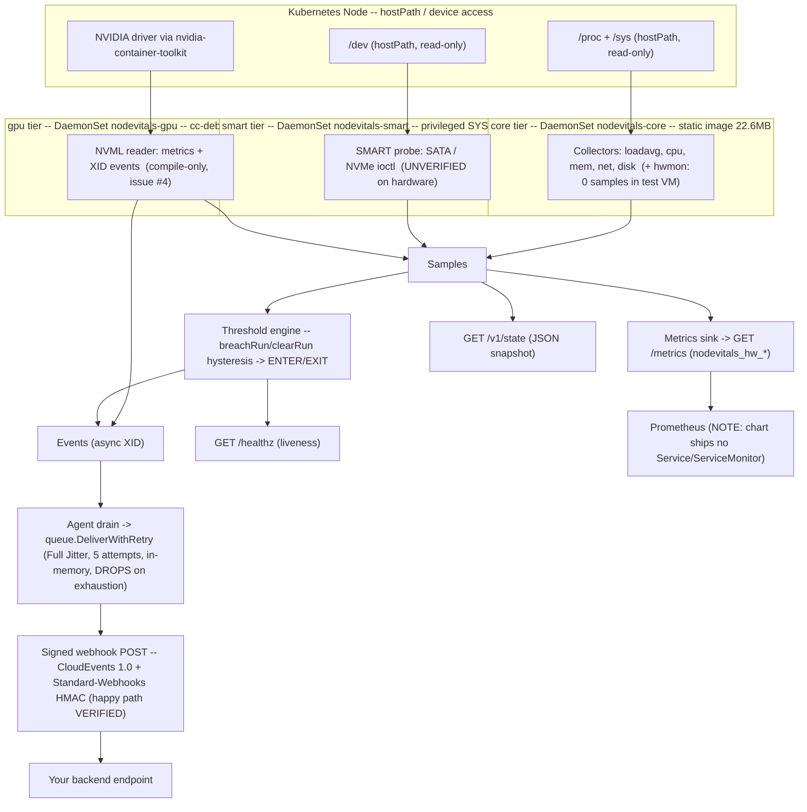

# nodevitals — Production-Readiness Report

> Repo: `github.com/KeiaiLab/nodevitals` · Assessed at `main @ a6f06b9` · Date: 2026-07-18
> Method: a 9-agent evidence-based audit — 1 image build + 6 parallel probes (in-container **runtime E2E**, signed-webhook **E2E**, image/supply-chain audit, Helm static audit, test-coverage audit, claims-vs-reality audit) → synthesis → **adversarial verification**. Read-only; no repo files were modified during the audit.

## Readiness level: **ALPHA** — beta-grade core, pre-alpha everything else

This is not a single number, and rounding it up would be dishonest:

| Surface | Grade | Why |
|---|---|---|
| **core tier (binary + runtime)** | **beta** | genuinely runtime-proven against a real Linux kernel (see below) |
| **deployment surface** (default `helm install`) | **pre-alpha** | rejected by PSA Baseline **and** leaks the webhook HMAC secret in plaintext |
| **smart + gpu tiers** | **pre-alpha** | never executed on hardware — compile/fixture-checked only |

The blended label is **alpha** — it correctly communicates *"not production-ready."* Honest, well-documented engineering with a strong core; not a shippable operations product yet.

---

## Executive summary

**What is genuinely proven (real executed evidence):**

- **Core-tier runtime E2E against a real Linux kernel** (the static image run in Docker, whose container `/proc`·`/sys` is a real Linux procfs): the agent started, registered its **6 collectors with 0 errors**, and served **226 samples/scrape**. `/metrics` and `/v1/state` counts agreed exactly (226 == 226). Values were **cross-validated byte-for-byte** against a second container's raw `/proc`: `load1=8.86` and `mem_total_bytes=8321798144` matched exactly, and live re-sampling was confirmed across 2-second ticks (load/cpu/mem all moved). Real non-zero `vda1` disk (~27.8 GB written) and `eth0` counters were read live.
  - **Caveat (applied from adversarial review):** of the 6 registered collectors, **5 are data-bearing**; **hwmon emitted 0 samples** because the test VM exposes no `/sys/class/hwmon` chips. hwmon ran its code path cleanly (no error), but its actual sensor-parsing branch (`temp*_input`/`fan*_input`, milli→°C) was **never exercised end-to-end** — only by unit fixtures. Real bare-metal Linux hardware is needed to prove it.
  - **Arch caveat:** the runtime E2E ran on a **native `linux/arm64`** image. The org-mandated **`linux/amd64`** runtime path was *not* exercised (compile-checked only).
- **Signed-webhook happy path E2E**: one real event POST was captured with a valid **CloudEvents 1.0** envelope + **Standard-Webhooks HMAC**; the signature was **independently re-derived** (Python `hmac` + `openssl`) and matched exactly.
  - **Scope (applied from adversarial review):** this proves **signing + envelope on the happy path only** — single event, single sink, ENTER-only, HTTP 200 on the first attempt, plain HTTP. Delivery **durability is unverified and structurally weak** — see the High gap below.
- **Unit suite:** 68/68 pass (0 skip), `go vet` / `gofmt` / `-race` all clean; `internal/*` 81.5–100% coverage (76.7% total, dragged down by an untested `cmd/nodevitals`).
- **Images build** and are authentic distroless: **core = 22.6 MB** static (nonroot, no shell — `exec sh` exits 127), **gpu = 55.3 MB** glibc/cc-debian12 with NVML `dlopen`'d; both stripped, no secrets baked in.

**What is NOT proven (verification ceiling — read before trusting any "verified" label):**

- **SMART tier** real device probe (`NewDevProbe`/`probeDevice`/`ataAttrs`/`uint128ToFloat64`) has **zero test invocations**; never run against real or emulated block devices. Compile-checked only.
- **GPU tier** real NVML reader (`nvml.Init`, XID `EventSet`/`watchXid`, `Close` shutdown-ordering — self-described in-code as *"the crux of correctness"*) has **zero test invocations**; no GPU anywhere. Tracked by **[issue #4](https://github.com/KeiaiLab/nodevitals/issues/4)**.
- The Helm audit is **100% static** (`helm template` + `kubeconform -strict` + `helm lint`); the PSA-rejection finding is derived from the canonical Pod-Security-Standards spec, **not** an observed live admission event.
- No live `helm install`, no CVE scan, no reproducible-rebuild test, no `govulncheck`. `ghcr.io/keiailab/nodevitals:0.1.0[-gpu]` existence is **unverified** (no publish pipeline found).

**Critical blockers (default install):** ① webhook HMAC secret rendered **plaintext into a ConfigMap**; ② default install **rejected by PSA Baseline** (hostPath `/proc`+`/sys`).

---

## Architecture (as-built)

## Readiness heatmap (tier × dimension)

Legend: **PASS** = executed proof · **PARTIAL** = works with gaps / static-only · **GAP** = missing/blocking · **UNVERIFIED** = never executed (compile/fixture only)

| Tier ↓ / Dimension → | build | runtime | deploy | observability | security | tests | docs |
|---|:---:|:---:|:---:|:---:|:---:|:---:|:---:|
| **core** | PASS | 🟢 **PASS** | PARTIAL | PARTIAL | PARTIAL | PASS | PARTIAL |
| **smart** | PARTIAL | 🔴 **UNVERIFIED** | PARTIAL | PARTIAL | PARTIAL | PARTIAL | PARTIAL |
| **gpu** | PARTIAL | 🔴 **UNVERIFIED** (#4) | PARTIAL | PARTIAL | PARTIAL¹ | PARTIAL | PARTIAL |
| **cross-cutting** | PARTIAL | — | PARTIAL | GAP (no CI) | 🔴 **GAP** (plaintext secret; 0/4 supply-chain) | PARTIAL | PARTIAL |

¹ gpu deploy manifests are **statically** PSA-Restricted-compliant (manifest ↔ spec cross-reference); not observed at a live admission controller.

**Reading it:** the single 🟢 runtime PASS (core) is the load-bearing proof of the entire assessment. The two 🔴 UNVERIFIED runtime cells (smart, gpu) plus the 🔴 cross-cutting security GAP (plaintext webhook secret + zero supply-chain controls) are what hold the product at **alpha** rather than beta.

---

## Per-tier findings (with evidence)

### Core tier — runtime-proven (strongest area)
- 6 collectors registered; logs show only the startup INFO line, **0 errors**. **5 data-bearing** (hwmon → 0 samples in the test VM; parse path unexercised — see caveat above).
- 226 samples/scrape, 14 metric families; `/metrics` count == `/v1/state` count exactly.
- **Byte-for-byte cross-validation** vs an independent container's raw `/proc`: `load1` and `mem_total_bytes` matched exactly; live re-sampling proven across 2s ticks.
- **Security reality:** good posture (nonroot, drop `[ALL]`) but core mounts hostPath `/proc`+`/sys`, which **PSA Baseline forbids**. The design doc's "baseline-hardened" claim is factually wrong (verified against the canonical PSS spec).

### SMART tier — fixture/compile only
- Pure-Go, cross-compiles clean (`GOOS=linux go build` exit 0).
- **Real probe code path has zero runtime execution on any platform.** Only `isWholeDevice` and the mapping layer (via a hand-rolled fake `probe`) are tested. `probeDevice`'s SATA/NVMe dispatch, ioctl reads, `ataAttrs`, `uint128ToFloat64` are uncovered.
- Legitimately privileged (`runAsUser:0`, `SYS_RAWIO`+`SYS_ADMIN`, hostPath `/dev`) — honestly documented, but the chart ships **no compensating controls** (no NetworkPolicy, no RBAC/exec hardening guidance).

### GPU tier — compile-check only (issue #4)
- `docker build --target gpu --platform=linux/amd64` exit 0; cc-debian12 dynamic ELF, NVML `dlopen`'d at runtime. Native darwin→linux cgo cross-compile **fails** → Docker is structurally required.
- **Real NVML reader never executed** (`nvml.Init`, XID `EventSet`/`watchXid`, `Close` ordering). Shipped XID mask (`XidCriticalError` only) may deviate from the M2b spec's broader mask — unverifiable without hardware.
- **Deploy manifests are the best of the three tiers:** statically PSA-Restricted-compliant (no hostPath, drop `[ALL]`, nonroot UID 65532) — a static determination, not a live-observed admission.

### Cross-cutting
- **Secret handling (critical):** `webhooks[].secret` renders verbatim into `kind: ConfigMap`; **0** Secret templates exist. Confirmed empirically with an `sk_live_...` test string.
- **Delivery durability (high):** `queue.DeliverWithRetry` is a synchronous 5-attempt Full-Jitter retry that **returns an error and drops the event on exhaustion** — no persistence, no later re-send. The M1 design's promised reliability layer (coalesced/bounded queue, critical-lane bypass, `nodevitals_delivery_dropped_total`, per-node phase-offset) is **absent from code** (`grep` = 0 hits for all four). For a product whose headline is "signed webhook push to your backend," event-loss-on-backend-outage is a real, unaddressed reliability floor.
- **Supply chain:** 0/3 `FROM` images digest-pinned; 0/4 of {SBOM, provenance, signing, scan}; design-doc `cosign+SBOM` promise unimplemented.
- **No CI:** both `.github/workflows/` and `.gitlab-ci.yml` are absent; gates are manual `make` targets. README's present-tense "runs in CI" and "built for amd64 and arm64" **overstate reality**.
- **Tests:** 76.7% total; `cmd/nodevitals` (tier-selection wiring) is **0.0%** with no test file.

---

## Gap list (blockers to real production use)

**Critical** (default install is unsafe/broken)
1. **Webhook HMAC secret in plaintext ConfigMap** — anyone with `get configmaps` (commonly granted) or the GitOps values file sees the signing key. → Add a `kind: Secret` / `existingSecret` path; mount via `secretKeyRef`. Never render secrets into `configmap*.yaml`.
2. **Default `helm install` rejected by PSA Baseline** (core hostPath `/proc`+`/sys`; smart adds SYS_RAWIO/SYS_ADMIN + `runAsNonRoot:false`). → Document the required namespace label / exemption in README + `NOTES.txt`; correct the "baseline-hardened" design-doc claim.

**High**
3. **Event delivery has no durability floor** — dropped after 5 attempts, no re-send; the spec'd reliability queue is unimplemented. → Add a bounded/coalesced queue with a `nodevitals_delivery_dropped_total` counter and (optionally) a critical-lane bypass; at minimum surface drops as a metric so silent loss is detectable.
4. **SMART real probe untested on hardware** → add a hardware/QEMU-block-device smoke gate; mark the tier "experimental / unverified on hardware" until then.
5. **GPU real NVML untested** (issue #4) → land the GPU smoke on a real NVIDIA node; reconcile the XID mask against the M2b spec.
6. **No Prometheus discovery** — no Service/ServiceMonitor/PodMonitor/scrape annotation, despite `/metrics` being a headline feature. → Add a values-gated Service + ServiceMonitor/PodMonitor.
7. **No SBOM/signing/scanning** (0/4) → wire syft + cosign + trivy/grype before the first `ghcr.io` publish; switch to a buildx driver that can emit attestations.
8. **No CI at all** → stand up enforced gates (`go test -race`, vet, gofmt, helm lint + kubeconform, amd64 gpu-tag compile). *(Downgraded from Critical per adversarial review — a maturity/process gap, not a runtime-deploy blocker like #1/#2; but the false "runs in CI" README claim is a genuine honesty defect to fix.)*

**Medium**
9. No `readinessProbe` on any of the 3 DaemonSets (liveness present) → add `httpGet /healthz` readiness on the metrics port.
10. `FROM` images unpinned (0/3) → pin to `@sha256` digests.
11. Smart tier (near-root) ships no NetworkPolicy / exec-RBAC guidance → add scoping.
12. `cmd/nodevitals` 0% + tier-switch untested → add a tier-selection table test.

**Low**
13. No `priorityClassName` (system-node-critical), no control-plane tolerations, no per-tier `resources`, no `values.schema.json`.
14. README multi-arch overclaim + stale `values.yaml` comments (still say "only core implemented" though M2b/M2c merged).

---

## Missed operator dimensions (not covered by any probe — gate on these before production)

The audit proved runtime *function*; it did **not** probe operational *behavior under real conditions*. A production operator should treat these as open:

- **Resource footprint under load** — the 226-series run was an idle 8-core VM; the chart's `64Mi` memory limit / no-CPU-limit was never load-tested against a node with many disks/NICs/rules. OOM/eviction risk unmeasured.
- **Metric cardinality / scale ceiling** — a busy bare-metal node (many block devices, per-core, cgroups) could balloon far past 226 series; no ceiling probed.
- **Graceful shutdown / SIGTERM** — DaemonSet pod termination and the GPU reader's `Close()` ordering (self-called "the crux of correctness") have **0 test invocations**.
- **Config hot-reload vs restart** — does a ConfigMap rule/sink change live-reload or require a pod restart? Untested.
- **DaemonSet upgrade / rollback** — `updateStrategy` is undeclared on all 3 DaemonSets; no rolling-update/rollback exercised.
- **Multi-arch runtime** — only the arm64 image was *run*; the mandated `linux/amd64` (and the cgo GPU binary under real amd64) was compile-checked only.
- **Delivery durability / at-least-once** — event loss after 5 failed retries, no persistence (also High gap #3).
- **Agent self-observability** — no scrape-duration metric, no per-collector error counter, no `nodevitals_delivery_dropped_total`; an operator cannot detect a silently-degrading collector (e.g. hwmon returning empty) from the agent's own signals.
- **Webhook transport security** — only plain HTTP to `host.docker.internal` was tested; TLS endpoints, redirects, non-2xx handling not exercised.
- **Long-running correctness** — counter reset/overflow handling and interval jitter under sustained load unobserved (only two 2s snapshots).

---

## What would make it production-ready (roadmap)

**Phase 1 — Security & correctness blockers (must)**
- Move the webhook secret to a k8s `Secret` (`secretKeyRef`), never plaintext.
- Ship PSA guidance / `NOTES.txt`; correct the core-tier "baseline" claim.
- Add a delivery-durability floor (bounded queue + `dropped_total` metric).
- Stand up CI (non-GitHub-Actions per org rule): `go test -race`, vet, gofmt, helm lint, kubeconform, amd64 gpu-tag compile — enforced on push. Fix the "runs in CI" README wording.

**Phase 2 — Prove the unproven tiers**
- GPU smoke on a real NVIDIA node (issue #4): `nvml.Init` → XID event → `Close` ordering; reconcile the event mask.
- SMART smoke on real/emulated block devices; cover `probeDevice` dispatch.
- Exercise the `linux/amd64` core runtime and a hwmon-present host (sensor-parsing branch).

**Phase 3 — Deploy completeness**
- `readinessProbe` on all tiers; Service + ServiceMonitor/PodMonitor; NetworkPolicy; `priorityClassName`; per-tier `resources`; `values.schema.json`.

**Phase 4 — Supply chain & release**
- Digest-pin `FROM` images; syft SBOM + cosign signing + trivy/grype scan; `govulncheck`; a verified `ghcr.io` publish pipeline producing the tags the chart references; multi-arch manifest (ADR-0001) or corrected docs.
- Add tier-selection tests for `cmd/nodevitals`.

---

## Audit method & honesty note

This report is the product of a 9-agent workflow: images built once, then 6 parallel probes gathered evidence (two of them **actually executed** the agent in a Linux container and captured real output; four performed static/code audits), a synthesis agent assembled the scorecard, and an **adversarial verifier** challenged every strong claim against the raw evidence. Four synthesis overclaims were caught and corrected here (unqualified "6/6 collectors" → "6 registered / 5 data-bearing"; "fully-verified webhook" → "happy-path signing only" + the durability gap; gpu PSA "verified" → "statically compliant"; "no CI" severity Critical → High). Every **PASS** in the matrix traces to an executed command with quoted output; every **UNVERIFIED** is honest about what could not be run on this hardware.
